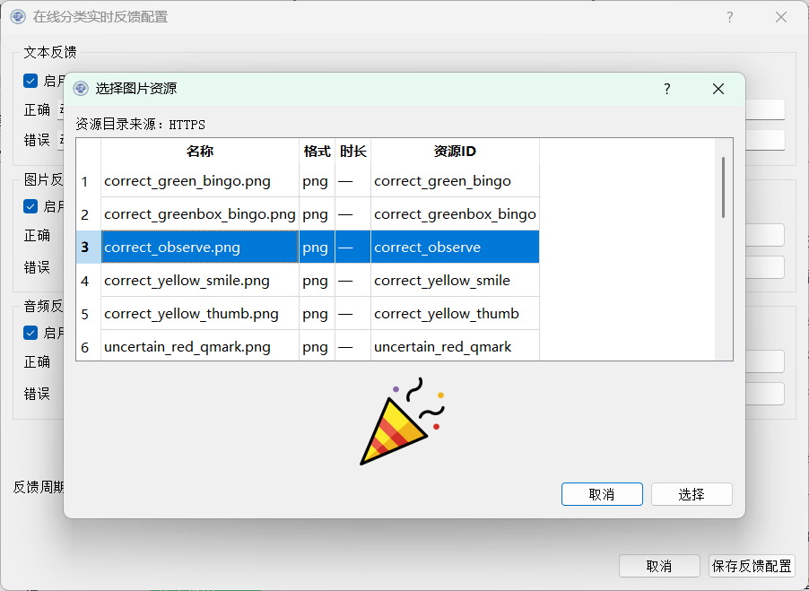

# README

[资源库地址](https://github.com/BCI-kate/eegheal_resource.git)

https格式的资源库，包括图片与音频，用以提供正确、错误、模糊3种类型的反馈

## 更新方式

在对应的[音频](eegheal_audio)或[图片](eegheal_images)目录下添加对应格式的图片或音频文件，其中图片为PNG；音频为OGG且编码方式为Vorbis。音频或图片添加完毕后使用项目中的[转换脚本](eegheal_update_resource_manifest.py)更新[JSON文件](eegheal_resource_manifest.json)以更新资源库

## 使用方式

EEGHeal项目专用，配置EEGHEAL_RESOURCE_MANIFEST_URL，值为"https://bci-kate.github.io/eegheal_resource/eegheal_resource_manifest.json"

## PyQt5效果展示

